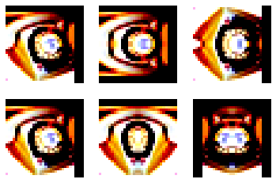

Data augmentation project
decalcomanie

# 실전기계

## MIXUP

|Dataset|DA|Acc|
|------|---|---|
|CIFAR-100|MIXUP|78.640|
|CIFAR-100|MIXUP(alpha=0.4)|79.750|
|CIFAR-100|horizondecalcomanie|76.670|
|CIFAR-100|random decalcomanie|77.070|

## décalcomanie
### horizon은 가로 데칼 ramdom은 가로세로 다 랜덤으로 하는거임 
_
